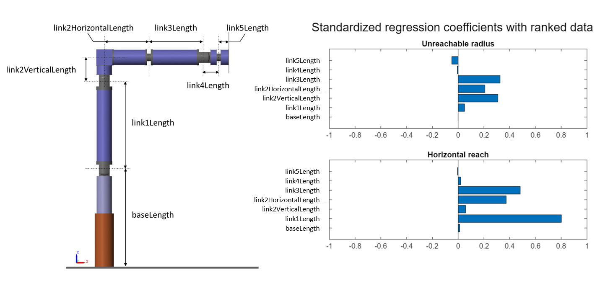

# Articulated Robot Design with Simscape

This project shows how to create a system-level simplified parametric 
articulated robot model in Simscape&trade; Multibody&trade; to accelerate 
Computer Aided Design (CAD) development. 
Articulated robots are an integral part of various industries, 
ranging from manufacturing and assembly to healthcare and research. The 
development of articulated robots involves the design, control, and 
implementation of mechanical systems capable of performing precise tasks.
Mechanical designers often use Computer-Aided Design (CAD) models to 
evaluate a design. To meet all the functional requirements, the CAD 
design process is generally iterative and can be time consuming. You can 
accelerate the development process by starting with a system-level analysis 
to evaluate your options.

This project contains a system-level simplified parametric robot model for 
stacking operation. Run this model for pre-defined stacking scenarios or 
create custom trajectories to see the robot trace a path as per your choice.

To design your own articulated robot, you can leverage the existing custom 
library blocks or create your new custom blocks.

<table>
  <tr>
    <td class="image-column" width=1200 height=900></td>
  </tr>
</table>

The project contains custom library blocks such Link, L-Link, Rotating Base 
With Bracket and Two Finger Gripper. The custom library blocks serve as 
early-stage or system-level mechanical design tools for quick prototyping 
and development of a simplified parametric articulated robot. The custom 
library blocks use the foundation of Simscape Multibody. You can parameterize 
custom library blocks to suit your application and assemble the parameterized 
blocks to build integrated robot models.

This project contains workflows where you learn how to:
1. Determine the work envelope for an articulated robot.

2. Perform a parameter sensitivity analysis for the robot work envelope to 
predict how the system performance depends on key design parameters

. 

3. Evaluate the actuator rating for an articulated robot.

4. Perform a Stacking Operation with an Articulated Robot

## Setup 
* Clone the project repository.
* Open ArticulatedRobotSimscape.prj to get started with the project. 
* Requires MATLAB&reg; release R2024a or newer.

Copyright 2023 - 2024 The MathWorks, Inc.
